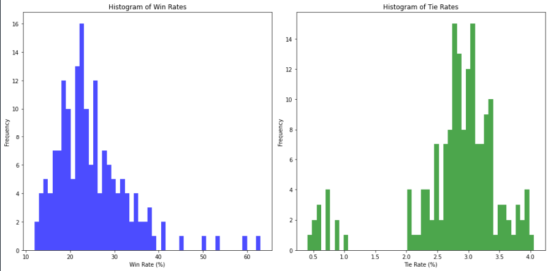

# Poker_Simulation_Analysis

Here is the main code: 🏹
[Poker Main Code](https://github.com/Jankoetf/Math-Task/blob/main/Poker.py)
🏹

Here is the visualization code:🐱‍👤
[Visualization](https://github.com/Jankoetf/Poker_Simulation_Analysis/blob/main/Poker_Visualization.ipynb)
🐱‍👤

  

## Visualisation

 - histogram of win rate density

- WinRate important private cards combinations intuition

- TieRate important private cards combinations intuition

  

**Thank you for exploring this project**

If you'd like to learn more about my background and qualifications, please visit my [LinkedIn profile](https://www.linkedin.com/in/jankomitrovic)
